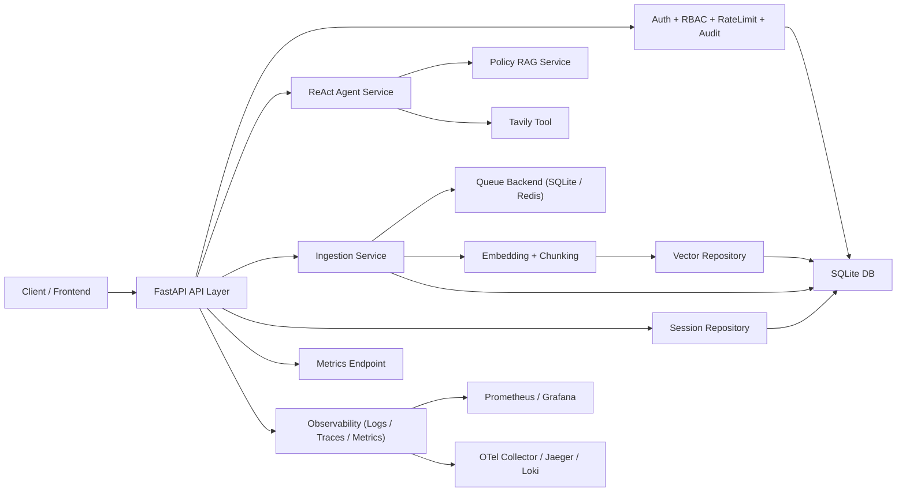

# RAG Agent Production Starter

🔥 A production-oriented RAG + ReAct agent service built with FastAPI, queue-based ingestion, and observability-first design.  
🚀 Built for secure agent APIs, async document ingestion, regression gating, and distributed stability validation.  
⭐ Supports JWT/API-Key auth, RBAC, rate limiting, audit logging, tracing, Prometheus metrics, and dataset-driven evaluation.

<p align="center">
  面向“可运行 + 可验证 + 可扩展”的智能体后端工程骨架（非单文件 Demo）
</p>

<p align="center">
  
  
  
  
  
  
</p>

---

## 目录

- [1. 项目定位](#1-项目定位)
- [2. 核心能力与亮点](#2-核心能力与亮点)
- [3. 典型使用场景](#3-典型使用场景)
- [4. 架构总览](#4-架构总览)
- [5. 核心模块拆解](#5-核心模块拆解)
- [6. API 能力地图](#6-api-能力地图)
- [7. 数据模型摘要](#7-数据模型摘要)
- [8. 项目结构](#8-项目结构)
- [9. 快速开始](#9-快速开始)
- [10. 配置说明](#10-配置说明)
- [11. 可观测性与日志追踪](#11-可观测性与日志追踪)
- [12. 评测与质量门禁](#12-评测与质量门禁)
- [13. 稳定性压测与分布式验证](#13-稳定性压测与分布式验证)
- [14. 安全机制说明](#14-安全机制说明)
- [15. 已知限制与后续优化](#15-已知限制与后续优化)
- [项目设计补充](#项目设计补充)
- [16. 许可证](#16-许可证)

---

## 1. 项目定位

这个仓库的目标不是“把模型接口调用通”，而是提供一套更接近真实上线形态的 AI Agent 后端工程：

1. 有清晰分层：`api / auth / ingestion / rag / queue / observability / storage`。
2. 有可运营能力：鉴权、权限、限流、审计、指标、日志、链路追踪。
3. 有可验证能力：回归评测、稳定性压测、CI 质量门禁。
4. 有可演进能力：保留 `mock` 与 `live` 双模式，便于迭代接入外部依赖。

它适合作为：

1. RAG + Agent 项目的工程化模板。
2. 面试/校招中的“可讲清楚工程细节”的代表项目。
3. 团队内部从 Demo 迈向可上线服务的基础骨架。

---

## 2. 核心能力与亮点

### 2.1 Agent + RAG 主干能力

- 基于 ReAct 风格的路由回答：内部知识优先走 `policy_search`，实时问题走 `tavily_search`。
- 支持会话历史持久化与上下文续接。
- 支持 `mock/live` 双模式，离线可测，联机可扩展。

### 2.2 安全基线（第一阶段）

- JWT 登录鉴权。
- API Key（可创建、可轮换扩展）。
- RBAC 权限控制（路由粒度权限）。
- 访问限流（内存或 Redis 后端）。
- 审计日志（关键操作留痕，带 request/trace/session/job 关联字段）。

### 2.3 异步摄取流水线（第二阶段）

- 文本/文件摄取统一入队。
- 任务状态机：`queued -> processing -> succeeded/failed`。
- 失败重试与指数退避。
- 幂等键去重。
- 死信标记（dead-lettered）。
- SQLite/Redis 双队列后端抽象。
- 独立 worker 进程支持。

### 2.4 观测体系（第三阶段）

- 结构化 JSON 日志。
- 请求与任务上下文字段贯通：`request_id / trace_id / session_id / job_id`。
- OpenTelemetry traces + OTLP logs 导出接入点。
- Prometheus 指标暴露与 Grafana dashboard 预置。

### 2.5 评测与质量保障（第四阶段）

- 多数据集回归：路由、单跳检索、多跳检索、幻觉防护、跨知识库。
- 自动生成 `JSON + Markdown` 回归报告。
- CI 中设置 pass-rate 质量门槛。
- 新增 API/队列稳定性压测脚本，输出标准化报告。

---

## 3. 典型使用场景

1. **企业内部知识助手**：接入制度文档、SOP、客服知识库，提供可追溯问答。
2. **“内部知识 + 外部实时信息”混合问答**：内部查政策，外部查天气/实时资讯。
3. **Agent 工程化课程/项目展示**：不是仅有 prompt，而是完整工程链路。
4. **团队 PoC 到生产过渡阶段**：先用这个骨架补齐安全、观测和质量门禁，再接业务。

---

## 4. 架构总览



---

## 5. 核心模块拆解

### 5.1 `app/api`

- 对外 HTTP 入口与 schema。
- 路由包含：`/chat`、`/ingestion/*`、`/sessions*`、`/metrics*`、`/admin/audit-logs`、`/auth/*`。

### 5.2 `app/auth` + `app/security` + `app/audit`

- 鉴权：JWT / API Key。
- 授权：RBAC 权限校验。
- 限流：内存或 Redis 计数器。
- 审计：操作行为与上下文记录。

### 5.3 `app/ingestion` + `app/queue`

- 文档上传、切分、向量化、异步入库。
- 队列后端抽象与 worker 执行循环。

### 5.4 `app/agent` + `app/rag` + `app/tools`

- Agent 路由、RAG 检索、外部工具调用。
- 保持 mock/live 可切换，便于测试与联调。

### 5.5 `app/observability`

- 指标注册与 Prometheus 文本导出。
- OpenTelemetry trace/log 接入与 span 包装。

### 5.6 `app/storage`

- SQLite schema 管理与 repository 层。
- 覆盖用户、角色、权限、会话、消息、摄取任务、向量数据、审计日志等。

---

## 6. API 能力地图

### 6.1 健康与示例

| Method | Path | 说明 |
|---|---|---|
| GET | `/health` | 健康检查与运行模式 |
| GET | `/chat/examples` | 默认示例问题 |

### 6.2 认证与身份

| Method | Path | 说明 |
|---|---|---|
| POST | `/auth/login` | 用户名密码登录，签发 JWT |
| GET | `/auth/me` | 当前主体信息 |
| POST | `/auth/api-keys` | 创建 API Key（需 `auth:manage_api_keys`） |

### 6.3 对话与会话

| Method | Path | 权限 |
|---|---|---|
| POST | `/chat` | `chat:write` |
| POST | `/sessions` | `sessions:write` |
| GET | `/sessions` | `sessions:read` |
| GET | `/sessions/{session_id}/messages` | `sessions:read` |

### 6.4 摄取与任务

| Method | Path | 权限 |
|---|---|---|
| POST | `/ingestion/text` | `ingestion:write` |
| POST | `/ingestion/upload` | `ingestion:write` |
| GET | `/ingestion/jobs` | `ingestion:read` |
| GET | `/ingestion/jobs/{job_id}` | `ingestion:read` |
| POST | `/ingestion/jobs/process` | `ingestion:process`（internal/admin） |
| GET | `/ingestion/documents` | `ingestion:read` |

### 6.5 观测与审计

| Method | Path | 权限 |
|---|---|---|
| GET | `/metrics` | `metrics:read` |
| GET | `/metrics/prometheus` | `metrics:read` |
| GET | `/admin/audit-logs` | `audit:read` |

---

## 7. 数据模型摘要

关键表（SQLite）：

| 表名 | 用途 |
|---|---|
| `users` / `roles` / `permissions` | 认证与权限模型 |
| `user_roles` / `role_permissions` | RBAC 关系 |
| `api_keys` | API Key 持久化 |
| `audit_logs` | 审计留痕 |
| `sessions` / `chat_messages` | 会话与消息历史 |
| `documents` / `document_chunks` | 文档与向量切片 |
| `ingestion_jobs` | 异步摄取任务状态机 |

`ingestion_jobs` 已扩展字段：

- `queue_backend`
- `idempotency_key`
- `trace_id`
- `attempt_count`
- `started_at`
- `finished_at`
- `dead_lettered`

---

## 8. 项目结构

```text
RAG-ReAct-Agent/
├── app/
│   ├── agent/
│   ├── api/
│   ├── audit/
│   ├── auth/
│   ├── core/
│   ├── ingestion/
│   ├── observability/
│   ├── queue/
│   ├── rag/
│   ├── security/
│   ├── storage/
│   └── tools/
├── deployments/
│   ├── Dockerfile
│   ├── docker-compose.yml
│   └── observability/
│       ├── docker-compose.yml
│       ├── otel-collector-config.yaml
│       ├── prometheus.yaml
│       ├── loki-config.yaml
│       └── grafana/
├── docs/
│   ├── architecture.md
│   ├── heavyweight-roadmap.md
│   └── operations-hardening.md
├── evaluation/
│   ├── dataset.json
│   └── datasets/
├── scripts/
│   ├── run_worker.py
│   ├── run_regression.py
│   └── run_stability_validation.py
├── tests/
├── src/
│   └── main.py
├── Makefile
├── requirements.txt
└── requirements-dev.txt
```

---

## 9. 快速开始

### 9.1 环境要求

推荐：

- Python `3.11` 或 `3.12`
- pip / venv
- 可选：Redis、Docker Desktop（观测栈联调）

> 说明：当前依赖中的部分 LangChain 生态包对 Python 3.14 兼容性有限，建议优先使用 3.11/3.12。

### 9.2 克隆与安装

```bash
git clone <your-repo-url>
cd RAG-ReAct-Agent
python3 -m venv .venv
source .venv/bin/activate
pip install -r requirements-dev.txt
cp .env.example .env
```

### 9.3 本地运行方式

1) CLI demo

```bash
python src/main.py --mode mock
```

2) 启动 API

```bash
uvicorn app.main:app --host 0.0.0.0 --port 8000 --reload
```

3) 启动独立 worker

```bash
python scripts/run_worker.py
```

4) 使用 Makefile

```bash
make api
make worker
make test
```

---

## 10. 配置说明

配置文件：`.env`（可由 `.env.example` 拷贝生成）。

### 10.1 模型与检索

- `OPENAI_API_KEY`
- `TAVILY_API_KEY`
- `PINECONE_API_KEY`
- `OPENAI_MODEL`
- `EMBEDDING_MODEL`
- `RETRIEVAL_TOP_K`

### 10.2 服务与日志

- `APP_HOST` / `APP_PORT`
- `LOG_LEVEL`
- `LOG_JSON`
- `DATABASE_PATH`

### 10.3 摄取队列

- `INGESTION_QUEUE_BACKEND`（`sqlite` 或 `redis`）
- `REDIS_URL`
- `INGESTION_MAX_RETRIES`
- `INGESTION_RETRY_BACKOFF_SECONDS`
- `INGESTION_RETRY_MAX_BACKOFF_SECONDS`
- `INGESTION_EMBEDDED_WORKER_ENABLED`

### 10.4 安全与权限

- `SECURITY_ENABLED`
- `JWT_SECRET`
- `JWT_ISSUER`
- `JWT_ACCESS_TOKEN_EXP_MINUTES`
- `BOOTSTRAP_ADMIN_USERNAME`
- `BOOTSTRAP_ADMIN_PASSWORD`
- `RATE_LIMIT_PER_MINUTE`

### 10.5 可观测性

- `PROMETHEUS_ENABLED`
- `OPEN_TELEMETRY_ENABLED`
- `OPEN_TELEMETRY_LOGS_ENABLED`
- `OTEL_EXPORTER_OTLP_ENDPOINT`
- `OTEL_EXPORTER_OTLP_LOGS_ENDPOINT`
- `OTEL_SERVICE_NAME`
- `OTEL_SERVICE_ENV`

---

## 11. 可观测性与日志追踪

### 11.1 应用内观测能力

- JSON 结构化日志。
- 关键关联字段：`request_id / trace_id / session_id / job_id / actor_id`。
- 指标覆盖：路由选择、RAG 命中、延迟、HTTP 请求维度、ingestion 任务状态维度。

### 11.2 Prometheus 指标接口

```text
GET /metrics/prometheus
```

### 11.3 本地观测栈联调

```bash
make obs-up
```

或：

```bash
docker compose -f deployments/observability/docker-compose.yml up --build -d
```

常用地址：

- API: `http://localhost:8000`
- Grafana: `http://localhost:3000`（`admin/admin`）
- Prometheus: `http://localhost:9090`
- Jaeger: `http://localhost:16686`
- Loki: `http://localhost:3100`

---

## 12. 评测与质量门禁

### 12.1 回归数据集

`evaluation/datasets/` 当前包含：

1. `routing_suite_v2`
2. `rag_single_hop_v2`
3. `rag_multi_hop_v2`
4. `hallucination_guard_v2`
5. `cross_kb_matrix_v1`

### 12.2 运行回归

```bash
python scripts/run_regression.py --mode mock --min-pass-rate 0.9 --fail-on-errors
```

报告输出：

- `reports/regression/latest.json`
- `reports/regression/latest.md`

### 12.3 CI 质量门禁

GitHub Actions 中已配置：

1. 单元测试。
2. 回归评测 pass-rate gate。
3. 队列稳定性 smoke 验证。

---

## 13. 稳定性压测与分布式验证

### 13.1 队列并发稳定性（多进程 worker）

```bash
python scripts/run_stability_validation.py queue \
  --jobs 240 \
  --workers 4 \
  --backend sqlite \
  --failure-ratio 0.1 \
  --max-retries 2
```

支持 Redis 队列后端：

```bash
python scripts/run_stability_validation.py queue \
  --backend redis \
  --redis-url redis://localhost:6379/0
```

### 13.2 API 并发压测

```bash
python scripts/run_stability_validation.py api \
  --mode inprocess \
  --total-requests 300 \
  --concurrency 40
```

报告输出：

- `reports/stability/queue_latest.json`
- `reports/stability/api_latest.json`
- `reports/stability/latest.json`

---

## 14. 安全机制说明

### 14.1 安全边界

1. 默认开启鉴权（`SECURITY_ENABLED=true`）。
2. 关键接口全部纳入权限校验。
3. 限流按“主体 + 路径”维度生效。
4. 关键操作写入审计日志，便于追溯。

### 14.2 当前已覆盖，后续建议

已覆盖：

- JWT
- API Key
- RBAC
- Rate Limit
- Audit Log

建议继续补强：

1. Refresh Token 与吊销机制。
2. API Key 轮换策略与过期策略。
3. 更细粒度审计归档与保留周期治理。

---

## 15. 已知限制与后续优化

### 15.1 当前限制

1. 默认 SQLite + 线程 worker 更偏开发/单机。
2. 观测栈已给出配置，但实际联调依赖本地 Docker daemon。
3. 评测集已经扩容，但仍可继续放大样本规模与语义评估维度。

### 15.2 后续路线

1. 引入 Alembic 管理 schema 迁移。
2. 增加 SLO burn-rate 告警与 on-call runbook。
3. 增加语义判分（judge model）与回归漂移检测。
4. 增强 Redis 分布式锁与幂等去重策略（高并发生产场景）。

---

## 项目设计补充

### 实现路径

本项目按“先可用、再工程化、再可运维”的路径推进：

1. 先稳定 Agent + RAG 主链路，保证 mock/live 双模式可运行。
2. 再补安全基线（JWT/API Key/RBAC/限流/审计）。
3. 再补异步 ingestion（队列、重试、死信、幂等、worker）。
4. 再补观测与质量体系（trace/log/metrics + regression + stability）。

### 关键难点

1. 在不推翻主干前提下，把 Demo 逻辑平滑升级为模块化工程。
2. 保证摄取任务“可重试但不乱重试”，并能追踪每个 job 的完整状态。
3. 让日志、指标、trace 共享同一套上下文 ID，便于问题闭环定位。
4. 让评测与压测脚本可落地执行，而不是停留在文档层。

### 当前处理方式

1. 通过 `app/api/dependencies.py` 统一依赖注入与安全策略。
2. 通过 `app/queue/*` 抽象队列后端，保留从 SQLite 到 Redis 的迁移路径。
3. 通过 `app/core/request_context.py` 贯穿 request/trace/session/job 上下文。
4. 通过 `scripts/run_regression.py` 与 `scripts/run_stability_validation.py` 固化验证流程。

---

## 16. 许可证

本项目采用 [MIT License](LICENSE)。
